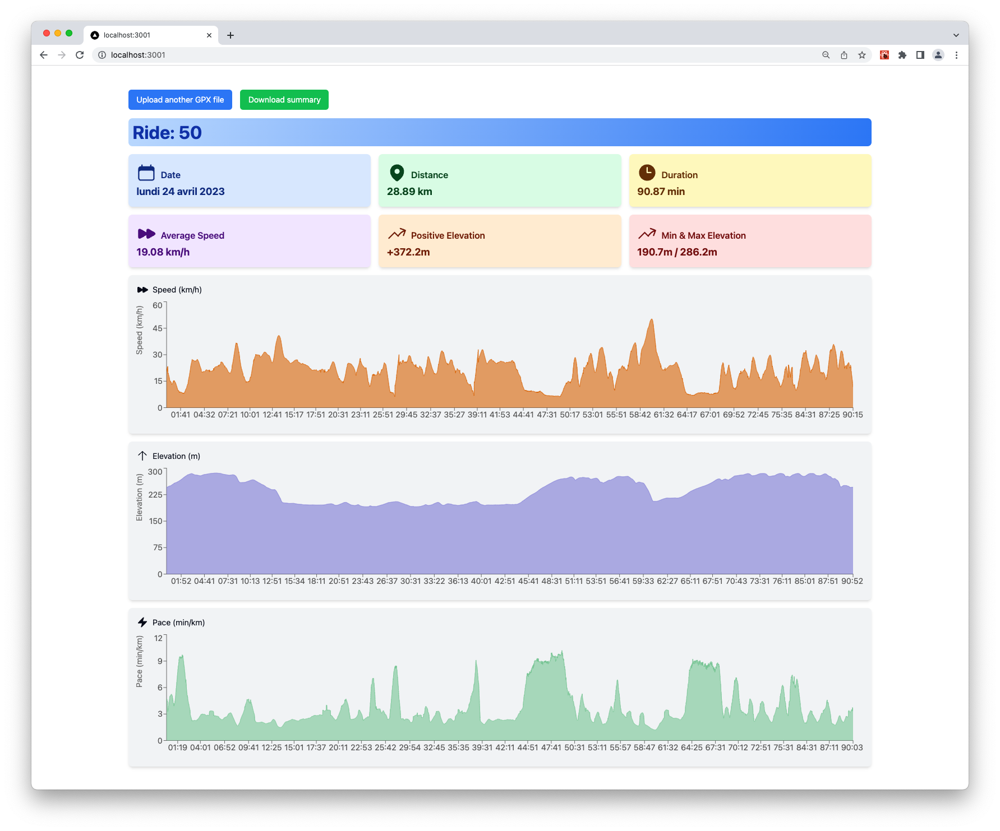

# Activity Summary App

Activity Summary App is a simple, clean, and responsive web application that allows users to upload a GPX file from Strava and receive a summary of their event. The summary includes the date of the activity, distance, duration, elevation, pace, and other derived metrics. The app was built using Next.js, Tailwind CSS, Recharts, and other libraries.

## Table of Contents

- [Features](#features)
- [Getting Started](#getting-started)
  - [Prerequisites](#prerequisites)
  - [Installation](#installation)
- [Built With](#built-with)
- [Acknowledgments](#acknowledgments)

## Features

- Upload a GPX file and view a summary of the event
- Display the date, distance, duration, elevation, and pace of the activity
- View additional derived metrics and charts
- Download a screenshot of the summary for sharing
- Responsive design for use on various devices



## Getting Started

### Prerequisites

To set up the project, you'll need to have Node.js installed. You can download the latest version from the official [Node.js website](https://nodejs.org/).

### Installation

1. Clone the repository:

```bash
git clone https://github.com/acid3croco/activity-summary-app.git
```

2. Change the working directory:

```bash
cd activity-summary-app
```

3. Install the dependencies:

```bash
npm install
```

4. Start the development server:

```bash
npm run dev
```

5. Open your browser and navigate to [http://localhost:3000](http://localhost:3000) to see the app in action.

## Built With

- [Next.js](https://nextjs.org/) - The web framework used
- [Tailwind CSS](https://tailwindcss.com/) - A utility-first CSS framework for rapid UI development
- [Recharts](http://recharts.org/) - A charting library built with React and D3.js
- [html2canvas](https://html2canvas.hertzen.com/) - A JavaScript library that allows you to take screenshots of web pages

## Acknowledgments

This project was built as a collaborative effort between the development team and ChatGPT, an AI language model by OpenAI. We're proud to have successfully built this app together, combining our expertise with cutting-edge AI technology.
